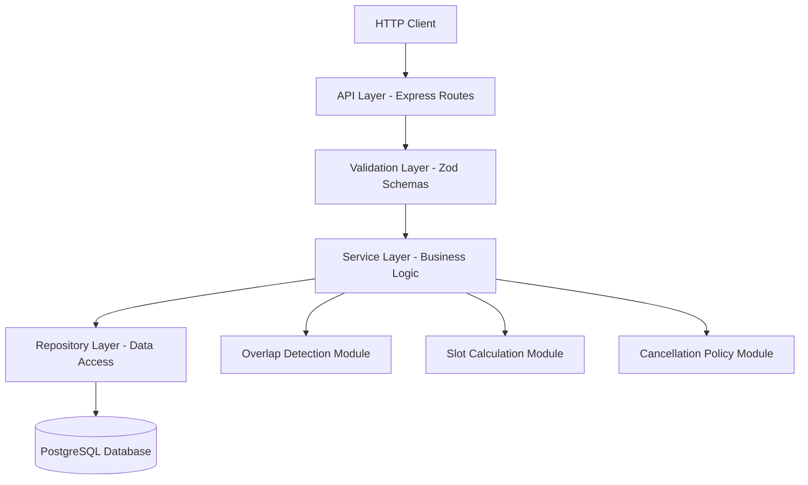
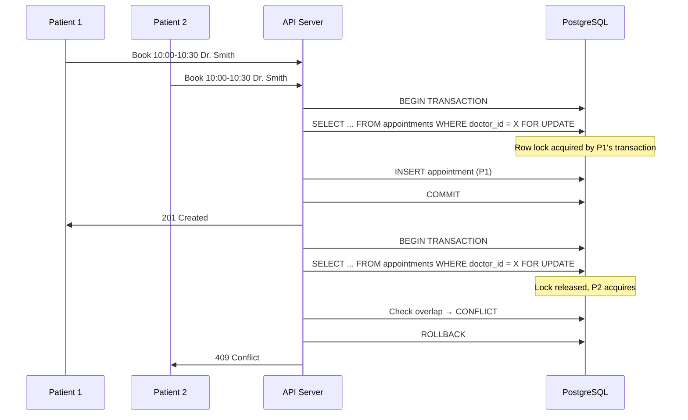
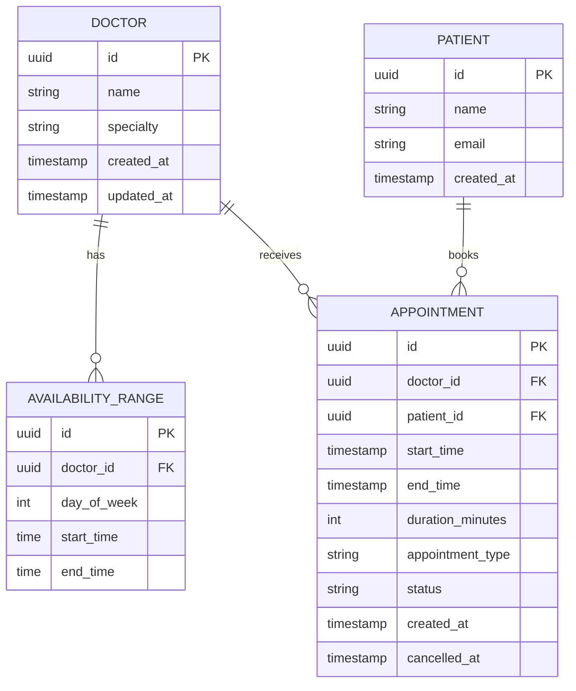

# Design Document: Appointment Scheduling

## Overview

This document describes the technical design for a medical appointment scheduling system implemented as a Node.js/TypeScript REST API. The system enables patients to search for doctors by specialty, book appointments in available time slots, cancel appointments subject to policy rules, and allows doctors to configure their availability schedules.

The core challenges addressed by this design are:
- **Overlap detection**: Preventing double-booking through a half-open interval comparison algorithm
- **Concurrency control**: Handling simultaneous booking requests via optimistic locking at the database level
- **Duration-based slot calculation**: Computing available time slots based on appointment type duration and existing bookings
- **Cancellation policy enforcement**: Enforcing a 24-hour cancellation window with proper authorization checks

The API follows RESTful conventions and uses PostgreSQL for persistence with row-level locking for concurrency safety.

## Architecture

The system follows a layered architecture pattern:



### Layer Responsibilities

| Layer | Responsibility |
|-------|---------------|
| API Layer | Route definitions, HTTP request/response handling, status codes |
| Validation Layer | Input validation, type coercion, error formatting |
| Service Layer | Business logic orchestration, transaction management |
| Repository Layer | SQL queries, database interaction, row mapping |

### Key Design Decisions

1. **PostgreSQL with advisory locks**: Chosen over in-memory locking to support horizontal scaling. `SELECT ... FOR UPDATE` on the doctor's appointment rows ensures serialized access during booking.
2. **Zod for validation**: Provides runtime type checking with TypeScript type inference, reducing duplication between validation and types.
3. **Express.js**: Lightweight, well-supported HTTP framework suitable for REST APIs.
4. **UUID v4 for identifiers**: Generates unique appointment IDs of sufficient length (36 characters) exceeding the 8-character minimum requirement.

## Components and Interfaces

### API Endpoints

#### Search Doctors
```
GET /api/doctors/search?specialty={specialty}&date={date}
```
- **Query Parameters**: `specialty` (required, enum), `date` (optional, ISO 8601 date)
- **Response 200**: `{ doctors: Doctor[], message?: string }`
- **Response 400**: Validation error (invalid specialty or date out of range)
- **Limit**: Maximum 50 results, ordered by earliest available slot

#### Book Appointment
```
POST /api/appointments
```
- **Body**: `{ patientId: string, doctorId: string, startTime: string (ISO 8601), appointmentType: "FIRST_VISIT" | "FOLLOW_UP" }`
- **Response 201**: `{ confirmation: BookingConfirmation }`
- **Response 409**: Conflict (time slot unavailable / overlap)
- **Response 400**: Validation error (invalid type, outside availability)

#### Cancel Appointment
```
POST /api/appointments/:appointmentId/cancel
```
- **Body**: `{ patientId: string }`
- **Response 200**: `{ message: string, appointmentId: string }`
- **Response 403**: Authorization error (not the patient's appointment)
- **Response 409**: Policy violation (within 24-hour window)
- **Response 404**: Appointment not found
- **Response 400**: Already cancelled or past appointment

#### Configure Doctor Availability
```
PUT /api/doctors/:doctorId/availability
```
- **Body**: `{ schedule: AvailabilitySchedule }`
- **Response 200**: `{ schedule: AvailabilitySchedule }`
- **Response 400**: Validation error (overlapping ranges, invalid times, max 5 ranges per day)

### Service Interfaces

```typescript
interface AppointmentService {
  bookAppointment(request: BookingRequest): Promise<BookingConfirmation>;
  cancelAppointment(appointmentId: string, patientId: string): Promise<void>;
}

interface DoctorService {
  searchDoctors(specialty: Specialty, date?: string): Promise<DoctorSearchResult>;
  updateAvailability(doctorId: string, schedule: AvailabilitySchedule): Promise<AvailabilitySchedule>;
}

interface SlotCalculator {
  calculateAvailableSlots(doctorId: string, date: string, duration: number): Promise<TimeSlot[]>;
  isSlotAvailable(doctorId: string, startTime: Date, endTime: Date): Promise<boolean>;
}

interface OverlapDetector {
  detectOverlap(existingAppointments: Appointment[], newStart: Date, newEnd: Date): OverlapResult;
}

interface CancellationPolicy {
  canCancel(appointment: Appointment, currentTime: Date): CancellationResult;
}
```

### Overlap Detection Algorithm

The overlap detection uses half-open interval comparison `[start, end)`:

```typescript
function intervalsOverlap(startA: Date, endA: Date, startB: Date, endB: Date): boolean {
  return startA < endB && startB < endA;
}
```

Two appointments overlap when any portion of their time ranges intersect. An appointment ending at 10:00 does NOT overlap with one starting at 10:00 (half-open interval semantics).

### Concurrency Handling



The `SELECT ... FOR UPDATE` statement locks all appointment rows for the target doctor within the relevant time window, serializing concurrent booking attempts.

### Slot Calculation Logic

Available slots are computed by:
1. Fetching the doctor's availability schedule for the target date's day of week
2. Fetching all existing (non-cancelled) appointments for the doctor on that date
3. For each availability time range, subtracting booked intervals to find free gaps
4. Filtering free gaps to only those >= requested duration
5. Generating slot start times at 15-minute increments within qualifying gaps
6. Excluding slots whose start time is in the past

## Data Models

### Entity Relationship Diagram



### TypeScript Types

```typescript
type Specialty = 
  | "cardiology" 
  | "dermatology" 
  | "neurology" 
  | "orthopedics" 
  | "pediatrics" 
  | "psychiatry" 
  | "general_practice";

type AppointmentType = "FIRST_VISIT" | "FOLLOW_UP";

type AppointmentStatus = "confirmed" | "cancelled";

interface Doctor {
  id: string;
  name: string;
  specialty: Specialty;
  createdAt: Date;
  updatedAt: Date;
}

interface Patient {
  id: string;
  name: string;
  email: string;
  createdAt: Date;
}

interface Appointment {
  id: string;
  doctorId: string;
  patientId: string;
  startTime: Date;
  endTime: Date;
  durationMinutes: number;
  appointmentType: AppointmentType;
  status: AppointmentStatus;
  createdAt: Date;
  cancelledAt: Date | null;
}

interface TimeSlot {
  startTime: Date;
  endTime: Date;
  available: boolean;
}

interface AvailabilityRange {
  dayOfWeek: number; // 0 = Sunday, 6 = Saturday
  startTime: string; // HH:mm format, 15-minute increments
  endTime: string;   // HH:mm format, 15-minute increments
}

interface AvailabilitySchedule {
  doctorId: string;
  ranges: AvailabilityRange[];
}

interface BookingRequest {
  patientId: string;
  doctorId: string;
  startTime: string; // ISO 8601
  appointmentType: AppointmentType;
}

interface BookingConfirmation {
  appointmentId: string;
  patientName: string;
  doctorName: string;
  specialty: Specialty;
  date: string;       // ISO 8601 date
  startTime: string;  // ISO 8601 datetime
  endTime: string;    // ISO 8601 datetime
  appointmentType: AppointmentType;
}

interface DoctorSearchResult {
  doctors: (Doctor & { availableSlots?: TimeSlot[] })[];
  message?: string;
}

interface OverlapResult {
  hasOverlap: boolean;
  conflictingAppointment?: Appointment;
  overlappingRange?: { start: Date; end: Date };
}

interface CancellationResult {
  allowed: boolean;
  reason?: string;
}
```

### Duration Constants

```typescript
const APPOINTMENT_DURATIONS: Record<AppointmentType, number> = {
  FIRST_VISIT: 60,
  FOLLOW_UP: 30,
};
```

## Correctness Properties

*A property is a characteristic or behavior that should hold true across all valid executions of a system—essentially, a formal statement about what the system should do. Properties serve as the bridge between human-readable specifications and machine-verifiable correctness guarantees.*

### Property 1: Search results are filtered, bounded, and ordered

*For any* set of doctors with varying specialties and availability schedules, and any valid search query (specialty + optional date), the returned results SHALL contain at most 50 doctors, all matching the requested specialty, each having at least one available future time slot on the specified date (if provided), ordered by earliest available slot, and each result SHALL include the doctor's available time slots for that date.

**Validates: Requirements 1.1, 1.2, 1.4**

### Property 2: Date range validation

*For any* date that is in the past or more than 90 days in the future, a search request with that date SHALL be rejected with a validation error.

**Validates: Requirements 1.6**

### Property 3: Overlap detection correctness

*For any* two time intervals `[startA, endA)` and `[startB, endB)` assigned to the same doctor, the system SHALL reject the second booking if and only if `startA < endB AND startB < endA`. When intervals do not overlap (including the case where one ends exactly when the other starts), both bookings SHALL be allowed.

**Validates: Requirements 3.1, 3.2, 3.5**

### Property 4: Rejected booking produces no side effects

*For any* booking request that is rejected (due to overlap, invalid type, outside availability, or any other validation failure), the system SHALL not persist any appointment data, and the set of existing appointments SHALL remain unchanged.

**Validates: Requirements 3.4**

### Property 5: Cancellation policy enforcement

*For any* appointment and any current time, cancellation SHALL be allowed if and only if the current time is more than 24 hours before the appointment's start time. When the difference is less than or equal to 24 hours, cancellation SHALL be rejected with a policy violation error.

**Validates: Requirements 4.1, 4.2**

### Property 6: Cancellation restores slot availability

*For any* appointment that is successfully cancelled, the time slot previously occupied by that appointment SHALL become available for new bookings, and a subsequent booking for the same doctor at the same time SHALL succeed.

**Validates: Requirements 4.3**

### Property 7: Cancellation authorization

*For any* appointment belonging to patient A, a cancellation request from patient B (where B ≠ A) SHALL be rejected with an authorization error, and the appointment SHALL remain unchanged.

**Validates: Requirements 4.5**

### Property 8: Booking confirmation completeness

*For any* successfully booked appointment, the returned confirmation SHALL contain a valid appointment identifier, patient name, doctor name, specialty, date in ISO 8601 format, start time in ISO 8601 format, end time in ISO 8601 format, and appointment type.

**Validates: Requirements 5.1, 5.2**

### Property 9: Appointment identifier uniqueness

*For any* set of successfully booked appointments, all generated appointment identifiers SHALL be unique and each SHALL be at least 8 characters in length.

**Validates: Requirements 5.3**

### Property 10: Duration invariant

*For any* booked appointment, the end time SHALL equal the start time plus the duration corresponding to the appointment type (60 minutes for FIRST_VISIT, 30 minutes for FOLLOW_UP).

**Validates: Requirements 5.4, 2.4, 2.5, 7.1, 7.2**

### Property 11: Availability schedule update preserves existing appointments

*For any* doctor with existing confirmed appointments, when the doctor's availability schedule is updated, all previously confirmed appointments SHALL remain unchanged in the system regardless of whether they fall within the new schedule.

**Validates: Requirements 6.2**

### Property 12: Availability enforcement

*For any* booking request where the requested time falls outside the doctor's configured availability schedule, or where the doctor has no availability schedule configured, the system SHALL reject the booking with an appropriate error.

**Validates: Requirements 6.3, 6.7**

### Property 13: Overlapping availability ranges rejected

*For any* availability schedule configuration containing two or more time ranges on the same day where any portion of their time ranges intersect, the system SHALL reject the configuration with a validation error.

**Validates: Requirements 6.5**

### Property 14: Slot calculation respects appointment duration

*For any* doctor's schedule with existing appointments, when calculating available time slots for a given appointment type, every returned slot SHALL have contiguous free time greater than or equal to the appointment type's duration. No slot SHALL be returned if the free gap at that time is less than the required duration.

**Validates: Requirements 7.3, 7.4, 7.5**

### Property 15: Generated slots respect availability boundaries

*For any* generated time slot, the slot's end time (start time plus the appointment type's duration) SHALL NOT exceed the doctor's availability schedule end boundary for that day.

**Validates: Requirements 7.7**

## Error Handling

### Error Response Format

All errors follow a consistent JSON structure:

```typescript
interface ErrorResponse {
  error: {
    code: string;
    message: string;
    details?: Record<string, unknown>;
  };
}
```

### Error Categories

| HTTP Status | Error Code | Scenario |
|-------------|-----------|----------|
| 400 | `INVALID_SPECIALTY` | Specialty not in accepted values |
| 400 | `INVALID_DATE_RANGE` | Date in past or > 90 days future |
| 400 | `INVALID_APPOINTMENT_TYPE` | Type is not FIRST_VISIT or FOLLOW_UP |
| 400 | `INVALID_TIME_RANGE` | Availability end <= start |
| 400 | `TOO_MANY_RANGES` | More than 5 ranges per day |
| 400 | `OVERLAPPING_RANGES` | Availability ranges overlap on same day |
| 400 | `ALREADY_CANCELLED` | Appointment already cancelled |
| 400 | `PAST_APPOINTMENT` | Cannot cancel past appointment |
| 400 | `INSUFFICIENT_TIME` | Free gap too short for requested type |
| 403 | `UNAUTHORIZED_CANCEL` | Patient doesn't own the appointment |
| 404 | `APPOINTMENT_NOT_FOUND` | Appointment ID doesn't exist |
| 404 | `DOCTOR_NOT_FOUND` | Doctor ID doesn't exist |
| 409 | `SLOT_UNAVAILABLE` | Time slot already booked (overlap) |
| 409 | `CANCELLATION_POLICY` | Within 24-hour cancellation window |
| 409 | `NO_AVAILABILITY` | Doctor has no schedule configured |
| 409 | `OUTSIDE_AVAILABILITY` | Requested time outside doctor's hours |

### Error Handling Strategy

1. **Validation errors** (400): Caught at the validation layer before reaching business logic. Return immediately with descriptive messages.
2. **Business rule violations** (403, 409): Caught in the service layer. Transactions are rolled back before returning the error.
3. **Not found errors** (404): Caught in the repository layer when queries return no results.
4. **Concurrency conflicts**: When `SELECT ... FOR UPDATE` reveals a conflict after lock acquisition, the transaction is rolled back and a 409 is returned.
5. **Unexpected errors** (500): Caught by global error handler. Logged with full context but returned to client with a generic message.

## Testing Strategy

### Testing Approach

The system uses a dual testing approach:

1. **Property-based tests** (using [fast-check](https://github.com/dubzzz/fast-check)): Verify universal properties across randomly generated inputs. Each property test runs a minimum of 100 iterations.
2. **Unit tests** (using Jest): Verify specific examples, edge cases, and error conditions.
3. **Integration tests** (using Jest + Supertest): Verify API endpoints, database interactions, and concurrency behavior.

### Property-Based Testing Configuration

- **Library**: fast-check (TypeScript-native PBT library)
- **Minimum iterations**: 100 per property
- **Tag format**: `Feature: appointment-scheduling, Property {N}: {description}`

### Test Organization

```
tests/
├── properties/
│   ├── overlap-detection.property.test.ts    (Properties 3, 4)
│   ├── cancellation-policy.property.test.ts  (Properties 5, 6, 7)
│   ├── booking-confirmation.property.test.ts (Properties 8, 9, 10)
│   ├── search.property.test.ts              (Properties 1, 2)
│   ├── availability.property.test.ts        (Properties 11, 12, 13)
│   └── slot-calculation.property.test.ts    (Properties 14, 15)
├── unit/
│   ├── overlap-detector.test.ts
│   ├── slot-calculator.test.ts
│   ├── cancellation-policy.test.ts
│   └── validation.test.ts
└── integration/
    ├── booking-flow.test.ts
    ├── cancellation-flow.test.ts
    ├── search-flow.test.ts
    ├── availability-config.test.ts
    └── concurrency.test.ts
```

### Key Test Generators (fast-check arbitraries)

```typescript
// Generate valid time ranges within a day
const timeRangeArb = fc.record({
  startHour: fc.integer({ min: 0, max: 22 }),
  startMinute: fc.constantFrom(0, 15, 30, 45),
  durationMinutes: fc.integer({ min: 15, max: 480 }),
});

// Generate valid appointment types
const appointmentTypeArb = fc.constantFrom("FIRST_VISIT", "FOLLOW_UP");

// Generate pairs of intervals for overlap testing
const intervalPairArb = fc.record({
  startA: fc.date({ min: new Date("2024-01-01"), max: new Date("2024-12-31") }),
  durationA: fc.integer({ min: 15, max: 120 }),
  startB: fc.date({ min: new Date("2024-01-01"), max: new Date("2024-12-31") }),
  durationB: fc.integer({ min: 15, max: 120 }),
});
```

### Unit Test Focus Areas

- Overlap detection edge cases (adjacent intervals, zero-duration, same start time)
- Validation logic (invalid specialties, date boundaries, time format)
- Duration assignment (FIRST_VISIT = 60, FOLLOW_UP = 30)
- Cancellation policy boundary (exactly 24 hours)
- Availability range validation (15-minute increments, max 5 per day)

### Integration Test Focus Areas

- Full booking flow (search → book → confirm)
- Concurrent booking attempts (verify only one succeeds)
- Cancellation flow with slot re-availability
- Schedule update with existing appointments
- Database transaction rollback on conflicts

