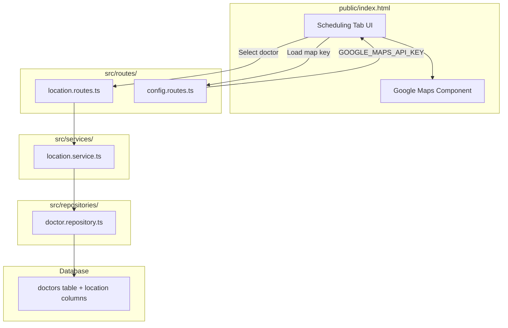

# Design: Google Maps Clinic Location

## Overview

This feature extends the existing appointment scheduling system with clinic location capabilities. Doctors can have a clinic address with geographic coordinates (latitude/longitude) stored in the database, and patients can view the clinic location on an interactive Google Maps widget when scheduling an appointment.

The implementation follows the project's existing layered architecture (Routes → Services → Repositories → Database) and integrates seamlessly with the current doctor management module. The frontend map component is added to the existing SPA (`public/index.html`) as part of the scheduling tab.

### Key Design Decisions

1. **Location stored on the doctors table** — Instead of a separate `locations` table, we add columns directly to `doctors`. Each doctor has at most one clinic location, making a 1:1 relationship that doesn't warrant an extra table.
2. **Google Maps JavaScript API loaded dynamically** — The map script is loaded only when needed (when a doctor with location is selected), avoiding unnecessary API calls.
3. **API key served via dedicated endpoint** — Rather than embedding the key in HTML at build time, a `/api/config/maps` endpoint returns the key. This keeps the key in environment variables and allows easy rotation.
4. **Coordinates validated server-side** — Latitude/longitude ranges are enforced by Zod schema validation before reaching the database.

## Architecture



### Request Flow: Save Location

1. Admin sends `PUT /api/doctors/:doctorId/location` with `{ address, latitude, longitude }`
2. Route validates body with Zod schema (`locationSchema`)
3. Service verifies doctor exists, then delegates to repository
4. Repository updates `clinic_address`, `latitude`, `longitude`, `updated_at` on `doctors` table
5. Returns 200 with updated location data

### Request Flow: Display Map

1. Patient selects a doctor in the Scheduling tab
2. Frontend calls `GET /api/doctors/:doctorId/location`
3. If location exists, frontend calls `GET /api/config/maps` to get API key
4. Google Maps JavaScript API is loaded dynamically
5. Map renders with marker at the doctor's coordinates
6. InfoWindow displays doctor name and address on marker click

## Components and Interfaces

### New Route File: `src/routes/location.routes.ts`

Handles location CRUD for doctors:

- `PUT /api/doctors/:doctorId/location` — Save/update clinic location
- `GET /api/doctors/:doctorId/location` — Retrieve clinic location

### New Route File: `src/routes/config.routes.ts`

Serves frontend configuration:

- `GET /api/config/maps` — Returns `{ apiKey: string }` from environment variable

### Service: `src/services/location.service.ts`

Business logic for location operations:

```typescript
export async function updateLocation(
  doctorId: string,
  data: { address: string; latitude: number; longitude: number }
): Promise<ClinicLocation>;

export async function getLocation(
  doctorId: string
): Promise<ClinicLocation | null>;
```

### Repository Extension: `src/repositories/doctor.repository.ts`

New functions added to existing repository:

```typescript
export async function updateLocation(
  doctorId: string,
  address: string,
  latitude: number,
  longitude: number
): Promise<ClinicLocationRow>;

export async function getLocation(
  doctorId: string
): Promise<ClinicLocationRow | null>;
```

### Validation Schema: `src/validation/schemas.ts`

New Zod schema for location input:

```typescript
export const locationSchema = z.object({
  address: z.string().min(1, "Address is required").max(500, "Address too long"),
  latitude: z.number()
    .min(-90, "Latitude must be >= -90")
    .max(90, "Latitude must be <= 90"),
  longitude: z.number()
    .min(-180, "Longitude must be >= -180")
    .max(180, "Longitude must be <= 180"),
});
```

### Frontend Component: Map Section in Scheduling Tab

A new `<div id="mapSection">` added to the Agendamento tab, containing:
- Address text display above map
- Loading indicator while map loads
- Map container (`<div id="clinicMap">`)
- "Location not available" message fallback
- InfoWindow on marker with doctor name + address

## Data Models

### TypeScript Interface: `ClinicLocation`

Added to `src/models/types.ts`:

```typescript
/**
 * Represents the geographic location of a doctor's clinic.
 */
export interface ClinicLocation {
  doctorId: string;
  address: string;
  latitude: number;
  longitude: number;
}
```

### Database Schema Change

Migration `005_add_clinic_location_columns.sql`:

```sql
ALTER TABLE doctors
  ADD COLUMN IF NOT EXISTS clinic_address VARCHAR(500),
  ADD COLUMN IF NOT EXISTS latitude DECIMAL(10,7),
  ADD COLUMN IF NOT EXISTS longitude DECIMAL(10,7);
```

- `clinic_address`: Free-text address (up to 500 chars), nullable
- `latitude`: Decimal with 7 decimal places (~ 1cm precision), range -90 to 90, nullable
- `longitude`: Decimal with 7 decimal places, range -180 to 180, nullable
- All nullable to allow doctors without location data
- `IF NOT EXISTS` ensures idempotent execution

### Error Codes

New error code added to `src/models/errors.ts`:

```typescript
/** Latitude or longitude out of valid range */
INVALID_COORDINATES: "INVALID_COORDINATES",
```

### API Response Formats

**PUT /api/doctors/:doctorId/location** (Success 200):
```json
{
  "location": {
    "doctorId": "uuid",
    "address": "Rua Example, 123, São Paulo - SP",
    "latitude": -23.5505199,
    "longitude": -46.6333094
  }
}
```

**GET /api/doctors/:doctorId/location** (Success 200, with data):
```json
{
  "location": {
    "doctorId": "uuid",
    "address": "Rua Example, 123, São Paulo - SP",
    "latitude": -23.5505199,
    "longitude": -46.6333094
  }
}
```

**GET /api/doctors/:doctorId/location** (Success 200, no data):
```json
{
  "location": null
}
```

**GET /api/config/maps** (Success 200):
```json
{
  "apiKey": "AIza..."
}
```


## Correctness Properties

*A property is a characteristic or behavior that should hold true across all valid executions of a system — essentially, a formal statement about what the system should do. Properties serve as the bridge between human-readable specifications and machine-verifiable correctness guarantees.*

### Property 1: Coordinate validation boundary

*For any* pair of numbers (lat, lng), if lat is within [-90, 90] and lng is within [-180, 180], the location schema SHALL accept the input; otherwise, it SHALL reject the input with a validation error indicating INVALID_COORDINATES.

**Validates: Requirements 1.3, 1.4, 1.5, 1.6**

### Property 2: Location data round-trip

*For any* valid location data (non-empty address string, valid latitude in [-90, 90], valid longitude in [-180, 180]), saving it via `updateLocation` and then retrieving it via `getLocation` SHALL return an equivalent object with the same address, latitude, and longitude values.

**Validates: Requirements 2.1, 3.1**

## Error Handling

### Error Responses

All errors follow the existing project pattern:

```json
{
  "error": {
    "code": "ERROR_CODE",
    "message": "Human-readable description"
  }
}
```

### Error Scenarios

| Scenario | HTTP Status | Error Code | Trigger |
|----------|-------------|------------|---------|
| Doctor not found | 404 | DOCTOR_NOT_FOUND | doctorId doesn't match any record |
| Missing required field (address, lat, lng) | 400 | VALIDATION_ERROR | Zod schema validation failure |
| Invalid coordinates | 400 | INVALID_COORDINATES | lat outside [-90,90] or lng outside [-180,180] |
| Google Maps API key not configured | 200 | — | Returns `{ apiKey: null }` with warning |
| Internal database error | 500 | INTERNAL_ERROR | Unexpected PostgreSQL failure |

### Frontend Error States

| State | Display |
|-------|---------|
| Map API key missing | "Mapa não configurado. Contate o administrador." |
| Doctor has no location | "Localização do consultório não disponível." |
| Map loading | Spinner/loading indicator |
| Google Maps script failed | "Erro ao carregar o mapa. Tente novamente." |

### Service Error Pattern

Following the existing `createServiceError` pattern from `doctor.service.ts`:

```typescript
if (!doctor) {
  throw createServiceError(ERROR_CODES.DOCTOR_NOT_FOUND, 'Doctor not found');
}
```

## Testing Strategy

### Unit Tests (`tests/unit/`)

- **`location.service.test.ts`** — Test service logic with mocked repository:
  - Returns location when doctor has one
  - Returns null when doctor has no location
  - Throws DOCTOR_NOT_FOUND for non-existent doctor
  - Successfully updates location for existing doctor

- **`location-validation.test.ts`** — Test Zod schema validation:
  - Accepts valid address + coordinates
  - Rejects missing address
  - Rejects missing latitude/longitude
  - Rejects out-of-range coordinates
  - Accepts boundary values (-90, 90, -180, 180)

### Property-Based Tests (`tests/properties/`)

Using **fast-check** (already installed in the project).

- **`location.property.test.ts`** — Property-based tests for correctness properties:
  - **Property 1**: Generate random coordinate pairs. If within valid range, schema accepts; if outside, schema rejects. Minimum 100 iterations.
  - **Property 2**: Generate random valid location objects (arbitrary strings for address, valid lat/lng). PUT + GET round-trip preserves data. Minimum 100 iterations.

Each property test tagged with:
```typescript
// Feature: google-maps-clinic-location, Property 1: Coordinate validation boundary
// Feature: google-maps-clinic-location, Property 2: Location data round-trip
```

### Integration Tests (`tests/integration/`)

- **`location-api.test.ts`** — Full API tests with real database:
  - PUT valid location → 200 + correct response body
  - PUT with missing fields → 400 + VALIDATION_ERROR
  - PUT with invalid coordinates → 400 + INVALID_COORDINATES
  - PUT with non-existent doctorId → 404 + DOCTOR_NOT_FOUND
  - GET existing location → 200 + correct data
  - GET non-existent doctor → 404 + DOCTOR_NOT_FOUND
  - GET doctor without location → 200 + null
  - PUT updates `updated_at` timestamp
  - Migration idempotency (run twice without errors)

- **`config-api.test.ts`** — Config endpoint tests:
  - GET /api/config/maps returns API key when env var is set
  - GET /api/config/maps returns null/error when env var is unset

### Testing Balance

- **Unit tests**: Validate schema logic, service error handling, specific edge cases
- **Property tests**: Verify coordinate validation universally and data round-trip integrity
- **Integration tests**: Verify full HTTP request/response cycle with real database
