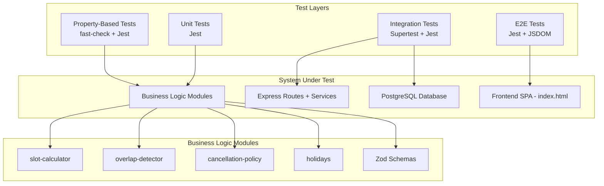

# Design Document: Test Automation Suite

## Overview

This document defines the technical design for a comprehensive test automation suite for the Medical Appointment Scheduling System. The suite covers four testing layers:

1. **Backend API integration tests** — Validates all REST endpoints using Supertest against a real PostgreSQL test database
2. **Backend unit tests** — Validates pure business logic modules in isolation (slot-calculator, overlap-detector, cancellation-policy, holidays)
3. **Property-based tests** — Validates mathematical invariants and correctness properties using fast-check with 100+ generated inputs per property
4. **Frontend E2E tests** — Validates user interactions across all tabs (Cadastro, Disponibilidade, Agendamento, Consultas) using DOM manipulation and fetch mocking

The design prioritizes correctness guarantees through property-based testing for pure logic modules, while using example-based integration tests for API wiring and E2E flows.

## Architecture



### Test Execution Strategy

- **Integration tests** run sequentially (`--runInBand`) against a dedicated test database, with transaction rollback or truncation between tests
- **Unit tests** and **property-based tests** run in parallel since they have no external dependencies
- **E2E tests** mock `fetch` and operate against JSDOM-rendered HTML

## Components and Interfaces

### 1. Test Infrastructure (`tests/setup/`)

| Component | Responsibility |
|-----------|---------------|
| `test-database.ts` | Creates/connects to test DB, provides `query()`, truncation helpers |
| `test-app.ts` | Exports configured Express app instance for Supertest |
| `test-factories.ts` | Factory functions for creating test doctors, patients, appointments |
| `jest.setup.ts` | Global setup/teardown hooks (DB migration, cleanup) |

### 2. Integration Test Suites (`tests/integration/`)

| File | Covers |
|------|--------|
| `doctors.test.ts` | POST /api/doctors, GET /api/doctors/all, GET /api/doctors, PUT /api/doctors/:id/availability |
| `patients.test.ts` | POST /api/patients, GET /api/patients |
| `appointments.test.ts` | POST /api/appointments, GET /api/appointments, POST /api/appointments/:id/cancel |
| `availability.test.ts` | GET /api/availability/:doctorId, PUT /api/availability/:rangeId, DELETE /api/availability/:rangeId |
| `holidays.test.ts` | GET /api/holidays, GET /api/states |

### 3. Unit Test Suites (`tests/unit/`)

| File | Covers |
|------|--------|
| `slot-calculator.test.ts` | `calculateAvailableSlots` with various inputs |
| `overlap-detector.test.ts` | `intervalsOverlap` and `detectOverlap` |
| `cancellation-policy.test.ts` | `canCancel` with various appointment states |
| `holidays.test.ts` | `getHolidaysForState`, `isHoliday`, `getHolidaysForMonth` |

### 4. Property-Based Test Suites (`tests/property/`)

| File | Covers |
|------|--------|
| `slot-calculator.property.test.ts` | Correctness Properties 1–6 |
| `overlap-detector.property.test.ts` | Correctness Properties 7–11 |
| `cancellation-policy.property.test.ts` | Correctness Properties 12–15 |
| `zod-schemas.property.test.ts` | Correctness Properties 16–20 |

### 5. E2E Test Suites (`tests/e2e/`)

| File | Covers |
|------|--------|
| `cadastro.test.ts` | Doctor and patient registration forms |
| `disponibilidade.test.ts` | Availability range CRUD via UI |
| `agendamento.test.ts` | Slot selection and booking flow |
| `consultas.test.ts` | Appointment listing and cancellation |

## Data Models

### Test Factory Interfaces

```typescript
interface TestDoctor {
  id: string;
  name: string;
  specialty: Specialty;
}

interface TestPatient {
  id: string;
  name: string;
  email: string;
}

interface TestAppointment {
  id: string;
  doctorId: string;
  patientId: string;
  startTime: Date;
  endTime: Date;
  durationMinutes: number;
  appointmentType: AppointmentType;
  status: AppointmentStatus;
}

interface TestAvailabilityRange {
  dayOfWeek: number;      // 0-6
  startTime: string;      // HH:mm (15-min increments)
  endTime: string;        // HH:mm (15-min increments)
}
```

### fast-check Arbitraries (Generators)

```typescript
// Valid availability range generator
const arbAvailabilityRange: fc.Arbitrary<TestAvailabilityRange>

// Valid appointment within a range generator
const arbAppointmentInRange: (range, date, duration) => fc.Arbitrary<Appointment>

// Valid half-open interval pair generator
const arbIntervalPair: fc.Arbitrary<{ startA: Date; endA: Date; startB: Date; endB: Date }>

// Valid booking request generator
const arbValidBookingRequest: fc.Arbitrary<BookingRequest>

// Invalid UUID generator (non-UUID strings)
const arbInvalidUUID: fc.Arbitrary<string>

// Valid 15-minute time string generator
const arbValidTime15Min: fc.Arbitrary<string>

// Invalid time string generator (minutes not in {0,15,30,45})
const arbInvalidTime15Min: fc.Arbitrary<string>
```

## Correctness Properties

*A property is a characteristic or behavior that should hold true across all valid executions of a system — essentially, a formal statement about what the system should do. Properties serve as the bridge between human-readable specifications and machine-verifiable correctness guarantees.*

### Property 1: Slot non-overlap with existing appointments

*For any* valid combination of availability ranges and non-cancelled existing appointments, *for all* slots returned by `calculateAvailableSlots`, no slot interval `[slot.startTime, slot.endTime)` shall satisfy `startA < endB AND startB < endA` with any active (non-cancelled) appointment interval.

**Validates: Requirements 10.1, 6.2**

### Property 2: Slot duration constancy

*For any* valid availability ranges and duration parameter (30 or 60 minutes), *for all* slots returned by `calculateAvailableSlots`, the difference `slot.endTime.getTime() - slot.startTime.getTime()` shall be exactly equal to `duration * 60 * 1000` milliseconds.

**Validates: Requirements 10.2, 6.3, 6.4**

### Property 3: Slot containment within availability boundaries

*For any* valid availability ranges and date, *for all* slots returned by `calculateAvailableSlots`, there must exist at least one availability range whose `dayOfWeek` matches the date's day of week such that `slot.startTime >= range.startTime` and `slot.endTime <= range.endTime` (when both are converted to Date objects for the same date).

**Validates: Requirements 10.3, 6.7**

### Property 4: Metamorphic — more appointments yield fewer or equal slots

*For any* valid availability ranges and date, the number of slots returned when `existingAppointments` is empty shall be greater than or equal to the number of slots returned when one or more confirmed appointments are added within the same availability range.

**Validates: Requirements 10.4**

### Property 5: Slot ordering by startTime

*For any* valid inputs to `calculateAvailableSlots`, *for all* consecutive slot pairs `(slots[i], slots[i+1])` in the returned array, `slots[i+1].startTime.getTime() >= slots[i].startTime.getTime()` shall hold.

**Validates: Requirements 10.5**

### Property 6: Slot grid alignment to 15-minute increments

*For any* valid inputs to `calculateAvailableSlots`, *for all* slots returned, `slot.startTime.getMinutes()` shall be in `{0, 15, 30, 45}` and `slot.startTime.getSeconds() === 0` and `slot.startTime.getMilliseconds() === 0`.

**Validates: Requirements 10.6**

### Property 7: Overlap commutativity

*For any* two valid half-open intervals `[A, B)` and `[C, D)` where `B > A` and `D > C`, `intervalsOverlap(A, B, C, D)` shall produce the same boolean result as `intervalsOverlap(C, D, A, B)`.

**Validates: Requirements 11.1**

### Property 8: Overlap reflexivity

*For any* valid half-open interval `[A, B)` where `B > A` (minimum 1ms difference), `intervalsOverlap(A, B, A, B)` shall return `true`.

**Validates: Requirements 11.2**

### Property 9: Half-open adjacency non-overlap

*For any* three timestamps `A < B < C`, `intervalsOverlap(A, B, B, C)` shall return `false` (adjacent half-open intervals do not overlap since the boundary point is exclusive in the first and inclusive in the second).

**Validates: Requirements 11.3**

### Property 10: Disjoint intervals non-overlap

*For any* two intervals `[A, B)` and `[C, D)` where `D.getTime() <= A.getTime()` or `B.getTime() <= C.getTime()`, `intervalsOverlap(A, B, C, D)` shall return `false`.

**Validates: Requirements 11.4**

### Property 11: Correct overlap range calculation

*For any* two overlapping intervals `[A, B)` and `[C, D)` where `intervalsOverlap` returns `true`, when `detectOverlap` is invoked with an appointment spanning `[A, B)` and proposed interval `[C, D)`, the result's `overlappingRange.start` shall equal `new Date(Math.max(A.getTime(), C.getTime()))` and `overlappingRange.end` shall equal `new Date(Math.min(B.getTime(), D.getTime()))`.

**Validates: Requirements 11.5**

### Property 12: Cancellation idempotency — cancelled appointments always denied

*For any* appointment with `status === "cancelled"` and *any* `currentTime` value, `canCancel(appointment, currentTime)` shall return `{ allowed: false }` with reason indicating already cancelled.

**Validates: Requirements 12.1, 8.1**

### Property 13: Cancellation permission when more than 24 hours before

*For any* appointment with `status === "confirmed"` where `startTime.getTime() - currentTime.getTime() > 86_400_000`, `canCancel(appointment, currentTime)` shall return `{ allowed: true }`.

**Validates: Requirements 12.2, 8.5**

### Property 14: Cancellation denied within 24-hour window (strict inequality)

*For any* appointment with `status === "confirmed"` where `0 < startTime.getTime() - currentTime.getTime() <= 86_400_000` (including exactly 24h), `canCancel(appointment, currentTime)` shall return `{ allowed: false }`.

**Validates: Requirements 12.3, 8.3, 8.4**

### Property 15: Past appointment immutability

*For any* appointment where `startTime.getTime() <= currentTime.getTime()` regardless of status, `canCancel(appointment, currentTime)` shall return `{ allowed: false }`.

**Validates: Requirements 12.4, 8.2**

### Property 16: Booking request schema accepts valid inputs

*For any* object with `patientId` as valid UUID v4, `doctorId` as valid UUID v4, `startTime` as valid ISO 8601 datetime string, and `appointmentType` in `["FIRST_VISIT", "FOLLOW_UP"]`, `bookingRequestSchema.safeParse` shall return `{ success: true }`.

**Validates: Requirements 13.1**

### Property 17: Booking request schema rejects invalid UUIDs

*For any* string that does not match UUID v4 format used as `patientId` or `doctorId` in an otherwise valid booking request, `bookingRequestSchema.safeParse` shall return `{ success: false }`.

**Validates: Requirements 13.2**

### Property 18: Specialty schema rejects invalid values

*For any* string not in `["cardiology", "dermatology", "neurology", "orthopedics", "pediatrics", "psychiatry", "general_practice"]`, `specialtySchema.safeParse` shall return `{ success: false }`.

**Validates: Requirements 13.3**

### Property 19: Availability time schema accepts valid 15-minute increments

*For any* time string in `HH:mm` format with hours in `[0, 23]` and minutes in `{0, 15, 30, 45}`, combined with valid `dayOfWeek` (0-6) and `endTime > startTime`, the availability range schema shall accept with `success: true`.

**Validates: Requirements 13.4**

### Property 20: Availability time schema rejects invalid increments

*For any* time string in `HH:mm` format where minutes are NOT in `{0, 15, 30, 45}` (e.g., 01, 02, ...14, 16, ...29, 31, ...44, 46, ...59), the availability range schema shall reject with `success: false`.

**Validates: Requirements 13.5**

## Error Handling

### Integration Test Error Handling

| Error Scenario | Expected Behavior | Test Assertion |
|---------------|-------------------|----------------|
| Database connection failure | Tests fail gracefully with clear message | `beforeAll` hook rejects with connection error |
| Test data leakage between suites | Each suite starts clean | `beforeEach` truncates relevant tables |
| Port conflicts | Tests use Supertest without binding port | `request(app)` pattern, no `listen()` needed |
| Timeout on slow queries | Jest timeout configured per suite | `jest.setTimeout(10000)` for integration tests |

### Property Test Error Handling

| Error Scenario | Expected Behavior | Test Assertion |
|---------------|-------------------|----------------|
| Generator produces invalid input | Pre-conditions filter out invalid combinations | `fc.pre()` guards in property body |
| Flaky due to date sensitivity | Use fixed reference dates, not `new Date()` | Deterministic `currentTime` parameter |
| Shrinking reveals minimal failing case | fast-check reports minimal counterexample | Default shrinking enabled |

### E2E Test Error Handling

| Error Scenario | Expected Behavior | Test Assertion |
|---------------|-------------------|----------------|
| Fetch mock not matching | Clear error about unmatched request | Custom `fetch` mock with assertion on unexpected calls |
| DOM element not found | Descriptive error with selector info | Helper functions with meaningful error messages |
| Async operations not settled | Proper wait mechanisms | `waitFor` helper using MutationObserver or polling |

## Testing Strategy

### Framework and Tools

| Tool | Purpose |
|------|---------|
| **Jest** | Test runner, assertions, mocking |
| **Supertest** | HTTP integration testing without running server |
| **fast-check** | Property-based testing with random input generation |
| **JSDOM** (via Jest) | DOM simulation for E2E frontend tests |

### Test Organization

```
tests/
├── setup/
│   ├── test-database.ts       # DB connection, migrations, truncation
│   ├── test-app.ts            # Express app export for Supertest
│   ├── test-factories.ts      # Factory functions for test entities
│   └── jest.setup.ts          # Global hooks
├── integration/
│   ├── doctors.test.ts
│   ├── patients.test.ts
│   ├── appointments.test.ts
│   ├── availability.test.ts
│   └── holidays.test.ts
├── unit/
│   ├── slot-calculator.test.ts
│   ├── overlap-detector.test.ts
│   ├── cancellation-policy.test.ts
│   └── holidays.test.ts
├── property/
│   ├── arbitraries.ts                        # Shared generators
│   ├── slot-calculator.property.test.ts
│   ├── overlap-detector.property.test.ts
│   ├── cancellation-policy.property.test.ts
│   └── zod-schemas.property.test.ts
└── e2e/
    ├── helpers/
    │   ├── dom-helpers.ts     # DOM query utilities
    │   └── fetch-mock.ts      # Fetch mocking utilities
    ├── cadastro.test.ts
    ├── disponibilidade.test.ts
    ├── agendamento.test.ts
    └── consultas.test.ts
```

### Property-Based Testing Configuration

- **Library**: `fast-check` (already installed as dev dependency)
- **Minimum iterations**: 100 per property (`{ numRuns: 100 }`)
- **Tag format**: Comment above each test with `Feature: test-automation-suite, Property N: <title>`
- **Seed reporting**: Enabled for reproducibility of failures
- **File naming**: `*.property.test.ts` (already matched by Jest config)

### Test Execution Commands

```bash
# Run all tests
npm test

# Run only property tests
npx jest --testPathPattern="property"

# Run only integration tests
npx jest --testPathPattern="integration"

# Run only unit tests
npx jest --testPathPattern="unit"

# Run only E2E tests
npx jest --testPathPattern="e2e"

# Run with coverage
npm run test:coverage
```

### Unit Test Balance

- **Unit tests** focus on: specific examples demonstrating correct behavior, boundary conditions (exact 24h for cancellation), known edge cases (empty lists, cancelled appointments), and error paths
- **Property tests** focus on: universal invariants (non-overlap, duration constancy, commutativity, containment), mathematical relationships between inputs and outputs, and covering the vast input space that unit tests cannot enumerate
- Together they provide confidence that both specific known scenarios AND arbitrary unknown scenarios are handled correctly

### Integration Test Strategy

- Tests run against a real PostgreSQL test database (configured via `DATABASE_URL` env var with test suffix)
- Each test suite uses `beforeEach` to truncate tables and re-seed only the data needed
- Tests verify both success paths and error responses with precise status codes and error codes
- No mocking of database — tests the full request lifecycle from HTTP to SQL and back

### E2E Test Strategy

- Tests load `public/index.html` into JSDOM
- `global.fetch` is mocked to simulate API responses
- Tests simulate user interactions: filling inputs, clicking buttons, selecting options
- Assertions verify DOM changes: success messages, list updates, error displays
- Tab navigation is tested by simulating click events on tab links
